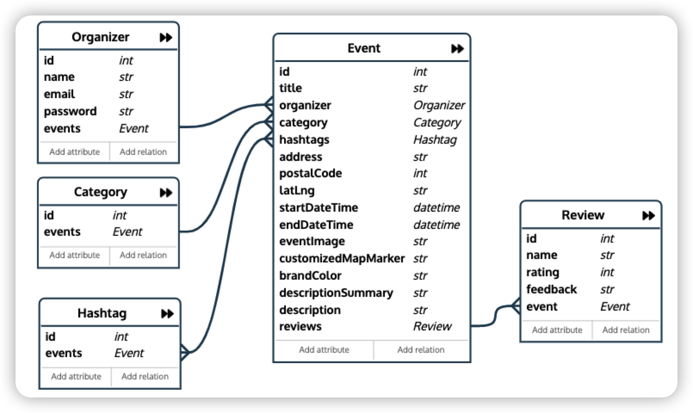

# eventful API
This is a restful API, designed using Node js (express) and Mongodb. It is mainly used to connect to its front-end web app, built using React.


| API  | description | Auth  | HTTPS  | CORS  |
| ------------- | ------------- | ------------- |------------- |------------- |
| [eventful API](https://eventfulapi.herokuapp.com/)   | resource to get events listed in Singapore  | No  |Yes |Yes |


>Disclaimer: the ongoing events in the database are dummy data, which are used for school project <em>only</em>. Please do not take them as formal events from the official organizers.


## 1. Base url deployed on Heroku
```
https://eventfulapi.herokuapp.com/
```

When rightly connected with the above end_point, the server will return:

```
You have connected to eventful API. Welcome!
```

## 2. GET
To get all events created in the database, use below end_point:
```
https://eventfulapi.herokuapp.com/events
```

### Additional query parameters:

For example, to search for education (category) events after "2022-03-22" with titles including "wellness" string, use below:
```
https://eventfulapi.herokuapp.com/events?category=education&startDateTime=2022-03-22&title=wellness
```
Combining with multiple parameters, making sophisticated query is possible.

| parameter  | value | usage  | 
| ------------- | ------------- | ------------- |
| title  | string  | search event by event title  |
| organizer  | string  | search event by organizer  |
| category  | string  | search event by category  |
| hashtags  | string |search event by hashtags  |
| startDateTime  | ISO date string e.g. "2022-03-23" |search events after this date  |
| search  | string |general search for matched events by the event title, organizer, and event description   |

### GET hashtags
```
https://eventfulapi.herokuapp.com/events/hashtags
```
### Get categories
```
https://eventfulapi.herokuapp.com/events/categories
```

## 3. POST
Use below to create a new event.
```
https://eventfulapi.herokuapp.com/events/create
```

Through the POST method, an object must be passed along with below fields.

#### Data Schema - event
| field  | value |
| ------------- | ------------- |
| title  | string  | 
| organizer  | string  | 
| category  | string  | 
| hashtags  | array  | 
| address  | string  | 
| postalCode  | number  | 
| latLng  | array e.g. [lat, lng]  | 
| startDateTime  | ISO date string e.g. "2022-02-12T10:00"  | 
| endDateTime  | ISO date string e.g."2022-02-13T10:00"  | 
| eventImage  | url string  | 
| customizedMapMarker  | url string  | 
| brandColor  | string e.g. "#ff0000" | 
| descriptionSummary  | string | 
| description  | string | 

## 4. PUT
To update an event, use below end point, where :id is the event id created by Mongodb.
```
https://eventfulapi.herokuapp.com/events/:id/update
```

Though the PUT request, pass along relevant fields to be updated with reference to the Data Schema table in 3.POST section.

### Create event reviews for existing events
```
https://eventfulapi.herokuapp.com/events/:id/reviews/create
```

Along with the PUT request, pass along an object with below data fields.
#### Data Schema - event review
| field  | value |
| ------------- | ------------- |
| name  | string  | 
| rating  | number 1-5  | 
| feedback  | string  | 

## 5. DELETE
Caution: DELETE is irrevocable.
```
https://eventfulapi.herokuapp.com/events/:id/delete
```

# Tech stack
| tech stack  | usage |
| ------------- | ------------- |
| Node js and express  | handle req and res |
| Mongodb  | connect to cloud database  |
| Mongodb Atlas  | cloud database |
| Heroku  | server for the API |

# Database design
The Organizer entity is currently embeded in the Event entity without the sign in/out function for users, to be implemented in the future. 

<em>One to many relationship</em>
- Organizer to Event
- Category to Event
- Review to Event

<em>Many to many relationship</em>
- Hashtag to Event



# Testing
Testing is done for all http methods using [Advanced Rest Client](https://install.advancedrestclient.com/install).

# Deployment steps
The deployment is done through [Heroku](https://devcenter.heroku.com/articles/git#deploy-your-code).
